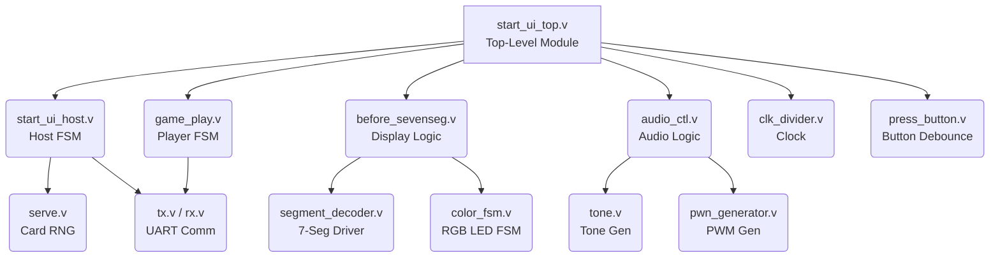

# FPGA Blackjack (21) - Digital Lab Final Project


This repository contains the Verilog source code and associated files for an FPGA-based implementation of the classic casino game **Blackjack (21)**. The project features full multiplayer functionality over UART and a complete hardware-based UI utilizing a seven-segment display, RGB LEDs, buttons, and an external speaker for audio feedback.

---

## 🌟 Key Features

- **Multiplayer Support**: Host up to 4 players via UART cross-board communication.
- **Hardware Game Logic**: Complete game logic implemented in hardware, handling card shuffling, drawing, betting, insurance, and win/loss/tie evaluations (including Blackjack and 5-Card Charlie rules).
- **Interactive UI**: Dynamic UI rendering game state, scores, bets, and cards on the board's 8-digit 7-segment display.
- **Audio Feedback**: PWM-based audio output for game events (dealing cards, betting, winning, losing, and tying).
- **RGB LED Indicators**: Visual game state and outcome indicators via the on-board RGB LED.
- **Hardware RNG**: Randomized card serving mechanism for fair play.

---

## 📂 Project Structure

The project code has been organized into clear directories for design sources, testbenches, and data.

```text
├── project code/        # Core synthesisable Verilog modules and XDC constraints
├── testbench/           # Simulation testbenches for individual components and full system
├── data/                # Screenshots and reference files
├── rgb/                 # Additional color/display testing modules
└── README.md            # This file
```

---

## 🏗️ Module Architecture

The system is designed with a clear separation of concerns, divided into Top-Level Control, FSMs (Host/Player), UI Drivers, and Peripheral Interfaces.



### Module Descriptions

*   **`start_ui_top.v`**: The central integration module linking game logic, UI, UART, audio, and physical I/O.
*   **`start_ui_host.v`**: The main state machine for the host. Manages overall game flow, multi-board synchronization, and dealer actions.
*   **`game_play.v`**: Core game logic for players, handling individual states like betting, hitting, and standing.
*   **`serve.v`**: Generates random cards and handles the shuffling mechanism.
*   **`before_sevenseg.v` & `segment_decoder.v`**: Translates internal game states (cards, money, options) into multiplexed 7-segment display signals.
*   **`color_fsm.v`**: Controls the RGB LED to indicate game results visually.
*   **`audio_ctl.v`, `tone.v`, `pwn_generator.v`**: Generates and maps PWM signals to trigger specific sound effects based on the current game event.
*   **`tx.v`, `rx.v`**: Universal Asynchronous Receiver-Transmitter modules for board-to-board communication.

---

## 🎮 Hardware Setup & Interface Guide

This project is mapped for the **Digilent Nexys 4 DDR** (xc7a100tcsg324-1) FPGA board via the `final_project_constraint.xdc` file located in the `project code/` directory.

### I/O Controls Map

| Control | Nexys 4 DDR Pin | Functionality |
| :--- | :--- | :--- |
| **SW15** | `V10` | **Role Selection:** High (`1`) = Host, Low (`0`) = Player |
| **BTN U** (Up) | `M18` | Hit (draw card), adjust bet amount up, navigate menus |
| **BTN D** (Down) | `P18` | Stand (end turn), shuffle cards, adjust bet amount down |
| **BTN C** (Center) | `N17` | Select/Confirm, Start Game |
| **BTN L/R** (Left/Right)| `P17` / `M17`| Scroll horizontally (e.g., viewing drawn cards) |
| **CPU RESET** | `C12` | System Reset (Active Low) |

### Visual & Audio Outputs

- **7-Segment Display**: Shows current game phase, bets, player cards, and dealer cards.
- **RGB LED 16 (`N15`, `M16`, `R12`)**: Glows different colors at the end of a round (Win/Loss/Tie).
- **Audio Out (PMOD JD, Pin 4 / `G3`)**: Connect a PWM audio amplifier PMOD or a raw speaker to hear dealing, betting, and result sound effects.

### Multiplayer UART Cross-Wiring

To play multiplayer, connect the TX of the Host to the RX of the Player, and vice versa using jumper wires. **Important:** All boards must share a common GND connection on the PMOD headers.

*   **Host to Player (PMOD JA)**
    *   RX: Pin 3 (`E18`)
    *   TX: Pin 4 (`G17`)
*   **Player 1 (PMOD JA)**
    *   RX: Pin 1 (`C17`)
    *   TX: Pin 2 (`D18`)
*   **Player 2 (PMOD JB)**
    *   RX: Pin 1 (`D14`)
    *   TX: Pin 2 (`F16`)
*   **Player 3 (PMOD JC)**
    *   RX: Pin 1 (`K1`)
    *   TX: Pin 2 (`F6`)
*   **Player 4 (PMOD JD)**
    *   RX: Pin 1 (`H4`)
    *   TX: Pin 2 (`H1`)

---

## 🚀 Setup and Synthesis (Vivado)

1. Create a new RTL Project in **Xilinx Vivado**.
2. Select the **Nexys 4 DDR (`xc7a100tcsg324-1`)** board/part.
3. Add all `.v` Verilog source files from the `project code/` directory.
4. Add the constraint file `project code/final_project_constraint.xdc`.
5. Set `start_ui_top.v` as the Top Module.
6. Run Synthesis, Implementation, and Generate Bitstream.
7. Open Hardware Manager, auto-connect to the board, and program the device.